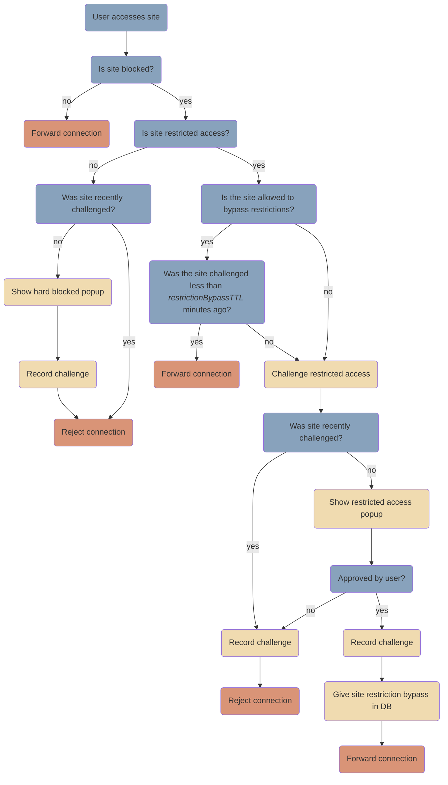

# `LentoDaemon` Documentation

## Proxy flow
*Note: the below diagram should render as a flowchart when previewed (Cmd/Ctrl-Shift-V in VSCode). Ensure your Markdown preview has Mermaid support - you may need [this VSCode extension](https://marketplace.visualstudio.com/items?itemName=bierner.markdown-mermaid), [this neovim extension](https://github.com/iamcco/markdown-preview.nvim), or equivalent.*



## Debugging

### Sending test data to the daemon
The `docs/example-daemon-input.json` file is the canonical spec for the data input format expected by the daemon. All data sent to and requested by the daemon should match this file - if not, either it should be corrected, or the `example-daemon-input.json` file updated to match.

A script is included to send this data to the daemon for manual debugging (the daemon should output a "DaemonServer on port XXXXX" log message that you can retrieve the port number from).
```
dart run :liveammotest [port]
```

### Manual testing
If you're running in dev, you want to use the `--devmode` flag when running the daemon so that it can find the `notifhelper` build in the repo, as opposed to a bundled version of it in prod:
```
dart run daemon --devmode
```
For VSCode users, this is included in the `launch.json` - just select the `daemon (dev mode)` configuration.

### DB
To inspect the state of the DB at runtime, I would recommend opening it up in some sort of SQLite DB browser. I use [DB Browser for SQLite](https://sqlitebrowser.org/) (download at link, or below for macOS):
```bash
brew install db-browser-for-sqlite
```

## Tests
To run the tests, you will first need to generate the appropriate mocks:
```bash
dart run build_runner build
```

- There is a very minimal test suite for the daemon - not everything is covered (most notably, none of the proxy)
- We have a mix of unit tests and integration tests
- While these get run in CI, please make regular local runs when extending/refactoring the daemon to avoid breaking functionality
- I would like to expand the test suite to cover more "user paths", so mainly integration tests that cover different possible situations encountered by the proxy/appblocker
    - Avoid adding more unit tests, the usefulness-to-maintenance-required ratio isn't great, and would likely require extensive mocking (db, `Process.run`s, etc)